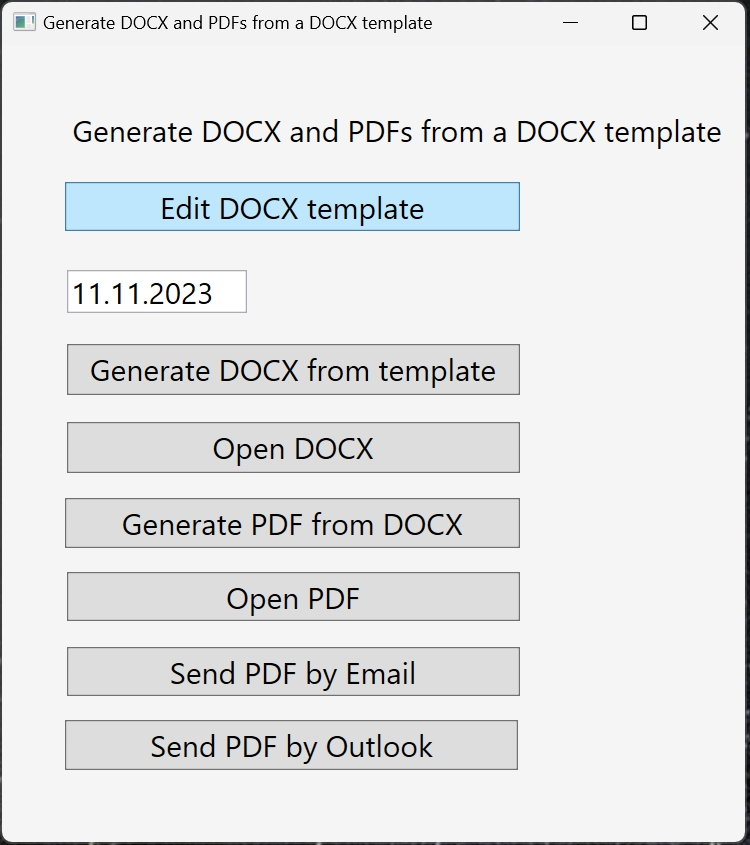
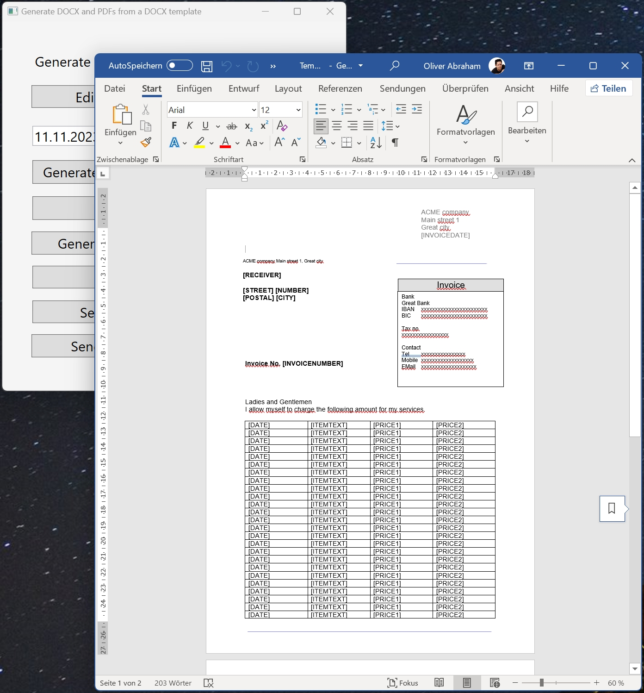
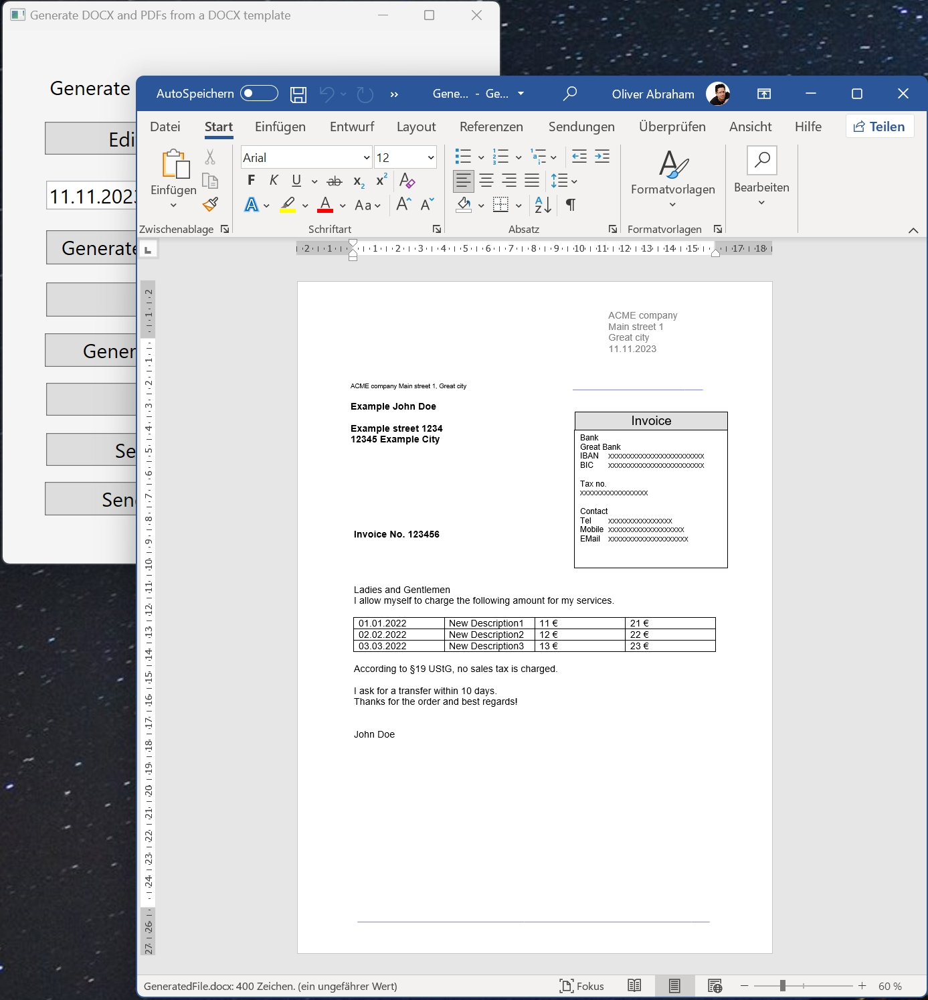
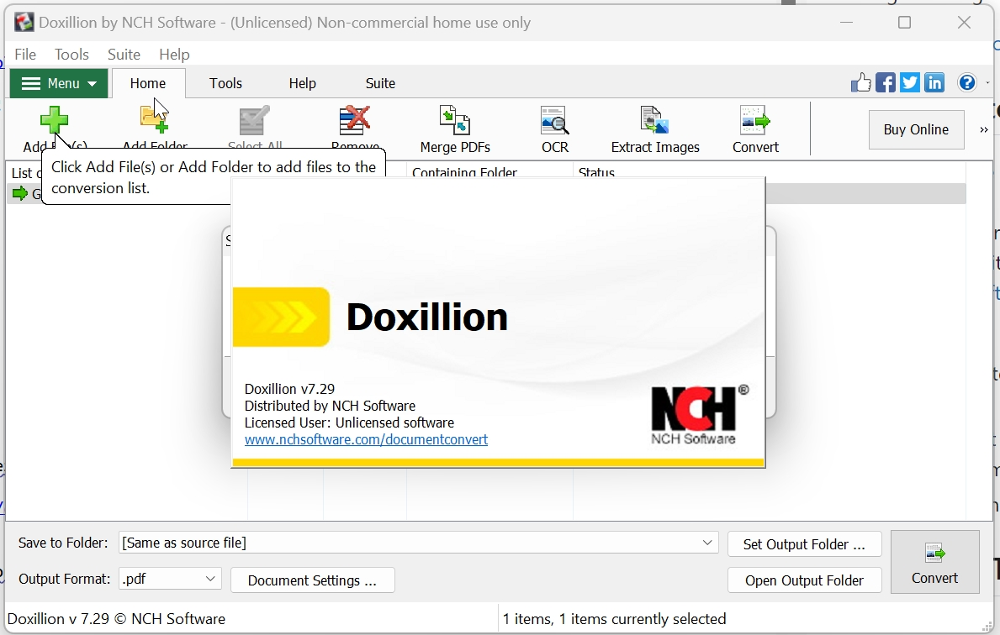
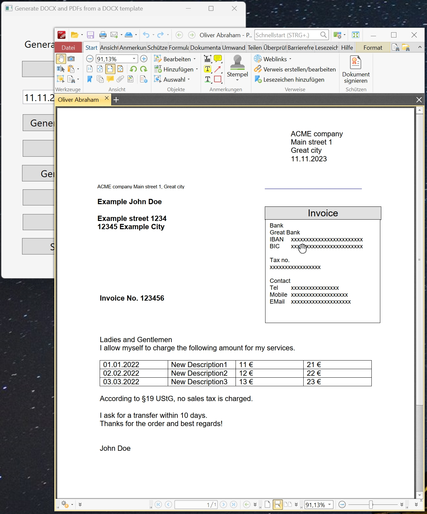
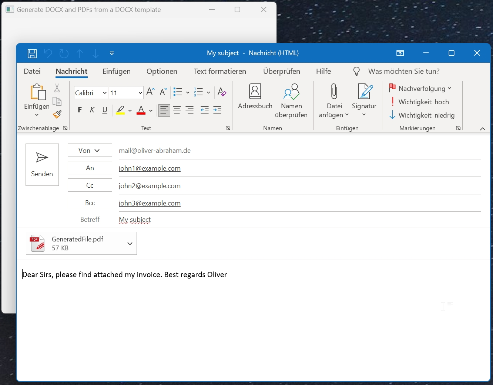

# Abraham.Office

    

## OVERVIEW

Generator for DOCX and PDF files, i.e. to generate PDF files and invoices from an easy to maintain DOCX template.
This library is a Nuget package to manipulate docx files (Microsoft Office file format) and to call a DOCX to PDf converter.
It works as a generator for docx files, by reading a docx template and replacing tokens in the file.

The basic idea was rto have a library to generate and email PDF invoices.
And to use Microsoft Word as a layout editor (because I find it easy to maintain templates with it).
I edit the template in word and then use my nuget package to replace tokens by actual values.
Then, use a DOCX to PDF converter (I'm using doxillion document converter, because I can call it like a command line tool with parameters).
Then I open up a new email window in Microsoft Outlook.
This gives me an easy to use solution to generate and email invoices.

Disadvantage: On the server, you need a graphical user interface to run the converter. 
If needed, you can configure a different converter, i.e. to be able to run on a linux machine.

## Source code

The source code is hosted at https://github.com/OliverAbraham/Abraham.Office

## License

Licensed under Apache licence.
https://www.apache.org/licenses/LICENSE-2.0

## Compatibility

The nuget package was build with DotNET 6.

## INSTALLATION

Install the Nuget package "Abraham.Office" into your application (from https://www.nuget.org).
Please refer to my demo application in this repository for more details.

## HOW TO INSTALL A NUGET PACKAGE
This is very simple:
- Start Visual Studio (with NuGet installed) 
- Right-click on your project's References and choose "Manage NuGet Packages..."
- Choose Online category from the left
- Enter the name of the nuget package to the top right search and hit enter
- Choose your package from search results and hit install
- Done!

or from NuGet Command-Line:

    Install-Package Abraham.Office

## AUTHOR

Oliver Abraham, mail@oliver-abraham.de, https://www.oliver-abraham.de

Please feel free to comment and suggest improvements!

## SOURCE CODE

The source code is hosted at:

https://github.com/OliverAbraham/Abraham.Office

The Nuget Package is hosted at: 

https://www.nuget.org/packages/Abraham.Office

## Getting started

This nuget package needs the Doxillion Document converter.
They offer a free version for non-commercial use.
You can download it from https://www.nchsoftware.com/documentconvert/index.html
Install the document converter, open it from the start menu and click through the help windows one time.
Then, you can close the application again.
My nuget package will open the document converter with parameters, to convert the docx file to PDF.

## SCREENSHOTS

Main screen of the demo:

Opening/editing the template:

Verifying the generated docx file: (notice we only have the 3 rows in the table)

Generating the PDF:

Opening the generated PDF:

Sending the PDF with Outlook:

# MAKE A DONATION !
If you find this application useful, buy me a coffee!
I would appreciate a small donation on https://www.buymeacoffee.com/oliverabraham

